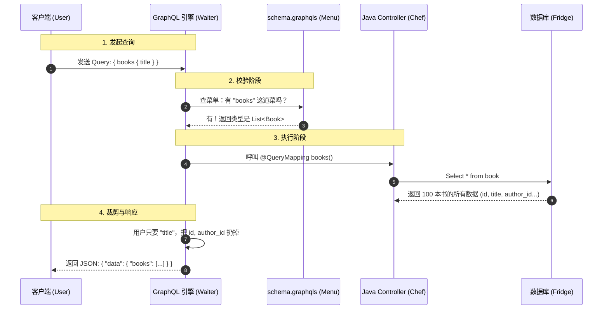

# GraphQL Examples

Spring for GraphQL 示例，含 Query/Mutation（CRUD）与 H2 持久化。

## 运行

```bash
mvn -q -pl examples-starter/graphql-examples spring-boot:run
```

- GraphiQL: `http://localhost:8086/graphiql`
- H2 Console: `http://localhost:8086/h2-console`（JDBC: `jdbc:h2:mem:graphql`）

## Schema 概览

```graphql
type Query {
  books: [Book!]!
  bookById(id: ID!): Book
}

type Mutation {
  createBook(input: CreateBookInput!): Book!
  updateBookTitle(input: UpdateBookTitleInput!): Book!
  deleteBook(id: ID!): Boolean!

  createAuthor(input: CreateAuthorInput!): Author!
  updateAuthorName(input: UpdateAuthorNameInput!): Author!
  deleteAuthor(id: ID!): Boolean!
}

type Book { id: ID!, title: String!, author: Author }
type Author { id: ID!, name: String! }

input CreateBookInput { id: ID!, title: String!, authorId: ID! }
input UpdateBookTitleInput { id: ID!, title: String! }
input CreateAuthorInput { id: ID!, name: String! }
input UpdateAuthorNameInput { id: ID!, name: String! }
```

## 查询示例

```graphql
query {
  books {
    id
    title
    author { id name }
  }
}
```

```graphql
query {
  bookById(id: 101) {
    id
    title
    author { name }
  }
}
```

## 变更示例（CRUD）

```graphql
mutation {
  createBook(input: { id: 104, title: "Domain-Driven Design", authorId: 3 }) {
    id
    title
    author { name }
  }
}
```

```graphql
mutation {
  updateBookTitle(input: { id: 104, title: "DDD" }) {
    id
    title
  }
}
```

```graphql
mutation {
  deleteBook(id: 104)
}
```

```graphql
mutation {
  createAuthor(input: { id: 4, name: "Kent Beck" }) { id name }
}
```

```graphql
mutation {
  updateAuthorName(input: { id: 4, name: "K. Beck" }) { id name }
}
```

```graphql
mutation {
  deleteAuthor(id: 4)
}
```

## GraphQL 原理与实战 (新手指南)

### 1. 通俗理解：餐厅点餐模型

如果你是**小白**，可以把 GraphQL 想象成一家**高级餐厅**的点餐过程：

*   **Schema (`schema.graphqls`) 是【菜单】**：
    *   上面写明了有什么菜（`Type`），能不能单点（`Query`），能不能改口味（`Mutation`）。
    *   **作用**：客人（前端）只能点菜单上有的东西。如果菜单上没有“红烧恐龙肉”，服务员在点餐阶段就会直接拒绝，根本不会去问厨师。这叫**类型安全**和**校验**。

*   **GraphQL 引擎 (Spring GraphQL) 是【服务员】**：
    *   他拿着你的点餐单（Query），一项一项去核对菜单。
    *   确认无误后，他会把任务拆分，分派给不同的负责区域。

*   **Controller (`@Controller`) 是【配菜员/档口】**：
    *   比如你点了“红烧肉套餐（含米饭、汤）”。
    *   `BookController` 就像是负责“红烧肉”的档口。
    *   `AuthorController` 就像是负责“汤”的档口。
    *   服务员喊一声：“来一份 Book！”，`BookController` 就开始工作。

*   **Service/DB 是【后厨/仓库】**：
    *   配菜员去仓库（数据库）拿原材料，加工好，交给服务员。

*   **JSON 响应 是【上菜】**：
    *   服务员把所有档口做好的东西，放在一个盘子里端给你。**你要什么，就上什么，不多也不少**（这就是 GraphQL 的核心优势：按需查询）。

### 2. 核心流程图解 (Flow)

这是一个请求从 客户端 到 数据库 再返回的完整过程：



### 3. 为什么要写 `schema.graphqls`？

很多新手觉得：“我写了 Java 代码，为什么还要写一遍 Schema？”

1.  **契约优先 (Contract First)**：前端和后端还没开发前，先定好 Schema。前端看 Schema 就能造假数据开发，不用等后端写完。
2.  **自动文档**：Schema 本身就是文档。GraphiQL 工具能自动提示你有什么字段，不用单独写 Swagger。
3.  **强类型校验**：
    *   如果你在 Schema 定义 `age: Int`，前端传了字符串 "abc"，GraphQL 引擎直接报错，你的 Java 代码甚至都不会被执行。省去了大量 `if (age is not number)` 的校验逻辑。

### 4. 代码与 Schema 是怎么对应的？

这是新手最容易晕的地方。请看对应关系：

**Schema (`schema.graphqls`)**:
```graphql
type Query {
    # 对应方法名 books
    books: [Book]
}

type Book {
    id: ID
    title: String
    # 这是一个复杂对象，可能需要二次查询
    author: Author
}
```

**Java Controller**:
```java
@Controller
public class BookController {

    // 1. 对应 type Query 里的 books 字段
    @QueryMapping // 默认匹配方法名 "books"
    public List<Book> books() {
        return bookService.findAll();
    }

    // 2. 对应 type Book 里的 author 字段
    // 当查询 books { author { ... } } 时，这个方法才会被调用
    // source 代表上一层查出来的 Book 对象
    @SchemaMapping(typeName = "Book", field = "author")
    public Author author(Book book) {
        return authorService.findById(book.getAuthorId());
    }
}
```

**总结**：
*   `@QueryMapping`: 处理顶级查询（菜单上的主菜）。
*   `@SchemaMapping`: 处理对象里的嵌套字段（主菜里的配菜，比如书的作者）。如果不写，默认调用 Getter 方法。

## 进阶篇：性能优化与分页 (Deep Dive)

### 1. 解决 N+1 问题 (Performance)

**问题描述**：
在最初的实现中，如果我们查询 `books { author { name } }` 并且数据库有 10 本书：
1.  系统先执行 `SELECT * FROM book` (1 次查询)。
2.  然后对每一本书，分别执行 `SELECT * FROM author WHERE id = ?` (10 次查询)。
这叫 **1+N 问题**，会严重拖慢性能。

**解决方案 (`@BatchMapping`)**：
Spring for GraphQL 提供了批处理功能。引擎会先把 10 本书收集起来，提取出所有的 `authorId`，然后**只发一次 SQL** 去查所有作者。

*   **代码变化**：
    ```java
    // 旧写法：一次查一个 (N 次 SQL)
    @SchemaMapping
    public Author author(Book book) { ... }

    // 新写法：一次查一批 (1 次 SQL)
    @BatchMapping
    public Map<Book, Author> author(List<Book> books) {
        // ... select * from author where id in (...)
    }
    ```

### 2. 分页查询 (Pagination)

在真实场景中，我们不可能一次返回所有数据。GraphQL 的分页通常有两种风格：
1.  **Connection 模式** (Relay 风格，较复杂，适合无限滚动)。
2.  **Page 模式** (传统风格，简单易懂，适合后台管理)。

本示例采用了 **Page 模式**：

*   **Schema 定义**：
    ```graphql
    type BookPage {
      content: [Book!]!
      totalElements: Int!
      totalPages: Int!
    }
    
    type Query {
      books(page: Int = 1, size: Int = 10): BookPage!
    }
    ```

*   **查询示例**：
    ```graphql
    query {
      books(page: 1, size: 5) {
        content {
          id
          title
        }
        totalElements
        totalPages
      }
    }
    ```

### 3. 字段按需查询 (Field Selection / Projection)

**问题描述**：
用户问了一个很好的问题：“如果后端查询了 10 个字段，但前端只要 2 个，那不是浪费数据库 IO 吗？”
是的，默认情况下 `findAll()` 会执行 `SELECT * FROM table`。

**解决方案 (`DataFetchingFieldSelectionSet`)**：
Spring for GraphQL 允许我们在 Controller 中注入 `DataFetchingFieldSelectionSet`，用来检查用户到底请求了哪些字段。

*   **模拟场景**：
    我们为 `Book` 增加了一个“重”字段 `description` (长文本)。
    
*   **代码实现 (`BookController` & `LibraryService`)**：
    ```java
    // 1. Controller 检测字段
    @QueryMapping
    public BookPage books(..., DataFetchingFieldSelectionSet selectionSet) {
        boolean withDescription = selectionSet.contains("content/description");
        return libraryService.findBooks(page, size, withDescription);
    }
    
    // 2. Service 根据 flag 调用不同的 Repository 方法
    public BookPage findBooks(int page, int size, boolean withDescription) {
        if (withDescription) {
             return bookRepository.findAll(pageable); // Select *
        } else {
             return bookRepository.findAllWithoutDescription(pageable); // Select id, title...
        }
    }
    
    // 3. Repository 使用 JPQL 构造函数投影 (Projection)
    @Query("select new BookEntity(b.id, b.title, b.authorId, b.price) from BookEntity b")
    Page<BookEntity> findAllWithoutDescription(Pageable pageable);
    ```

*   **MyBatis / MyBatis-Plus 实现思路**：
    如果你使用的是 MyBatis，逻辑是类似的。你可以将字段列表传递给 XML Mapper。
    
    **XML 伪代码示例**：
    ```xml
    <select id="selectBooks" resultType="Book">
      SELECT id, title, author_id, price
      <if test="fields.contains('description')">
        , description
      </if>
      FROM books
      LIMIT #{size} OFFSET #{offset}
    </select>
    ```
    这样，只有当 `fields` 集合包含 `description` 时，SQL 才会查询该字段。

*   **效果**：
    *   如果你查 `{ books { content { title } } }` -> 后台日志显示 "Skipping description fetch"。
    *   如果你查 `{ books { content { title description } } }` -> 后台日志显示 "Performing heavy fetch"。

## 常用注解详解 (Annotations)

Spring for GraphQL 提供了丰富的注解来简化开发。以下是核心注解的说明与示例。

| 注解 | 作用 | 对应 GraphQL 概念 | 示例 |
| :--- | :--- | :--- | :--- |
| `@QueryMapping` | 处理顶级查询 | `type Query` | `public List<Book> books()` |
| `@MutationMapping` | 处理变更操作 | `type Mutation` | `public Book createBook(...)` |
| `@SchemaMapping` | 处理嵌套字段/对象字段 | `type Object { field }` | `public Author author(Book book)` |
| `@Argument` | 获取查询参数 | `func(arg: Type)` | `public Book bookById(@Argument Long id)` |
| `@BatchMapping` | 解决 N+1 问题，批量加载 | DataLoader | `public Map<Book, Author> author(List<Book> books)` |

### 代码示例 (Demo)

在 `BookController` 中，我们展示了如何使用 `@SchemaMapping` 来添加一个数据库中不存在的“计算字段”。

**Schema**:
```graphql
type Book {
  # ... 其他字段
  formattedTitle: String # 数据库没这个字段，是后端拼接的
}
```

**Java**:
```java
@Controller
public class BookController {

    // 处理普通查询
    @QueryMapping
    public BookPage books(...) { ... }

    // 处理计算字段：当前端请求 formattedTitle 时才会调用此方法
    // source (Book) 是父对象
    @SchemaMapping
    public String formattedTitle(Book book) {
        return String.format("《%s》", book.getTitle());
    }
}
```

## 生产级配置 (Configuration)

### HikariCP 连接池配置

在 `application.yml` 中配置 HikariCP 是生产环境的标准做法：

```yaml
spring:
  datasource:
    hikari:
      minimum-idle: 5              # 最小空闲连接数
      maximum-pool-size: 20        # 最大连接池大小
      idle-timeout: 30000          # 空闲超时 (ms)
      max-lifetime: 1800000        # 连接最大生命周期 (ms)
      connection-timeout: 30000    # 获取连接超时 (ms)
      pool-name: GraphQLExampleHikariCP
```
